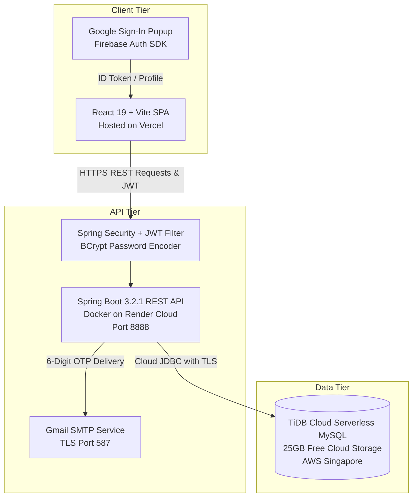

# 👗 INVENTRA — Smart Fashion Retail Cloud & Inventory Management System

> **Enterprise Operating System for Modern Fashion & Apparel Retail Businesses**  
> Built with **Spring Boot 3 (Java 21/17)**, **React 19 + Vite**, **TiDB Cloud MySQL (25GB)**, **Firebase Authentication**, and **Spring Security JWT**.

---

## 🌐 Live Deployment Links

| Service | Platform | Live URL | Status |
| :--- | :--- | :--- | :---: |
| 🚀 **Web Application (Frontend)** | **Vercel** | [https://inventra-fashion-retail.vercel.app](https://inventra-fashion-retail.vercel.app) *(or your Vercel URL)* | 🟢 **LIVE** |
| ⚙️ **REST API Server (Backend)** | **Render** | [https://inventra-backend-1ctb.onrender.com](https://inventra-backend-1ctb.onrender.com) | 🟢 **LIVE** |
| 🗄️ **Cloud Database (MySQL)** | **TiDB Cloud Serverless** | `gateway01.ap-southeast-1.prod.aws.tidbcloud.com:4000` (Singapore) | 🟢 **LIVE (25GB)** |
| 🎥 **Project Demo Video** | **Google Drive** | [Watch Demo Video](https://drive.google.com/drive/folders/1Ak51j0V8khUL8yzsVK9SpxzvISoLPK7r?usp=sharing) | 🎬 **READY** |

---

## 📸 Architecture Diagram



---

## 👑 Role-Based Access Control (RBAC)

INVENTRA comes out-of-the-box with multi-tier role authorization:

### 1. 🛡️ Administrator (`ADMIN`)
* **User Management**: Approve pending manager registrations, toggle roles, view user directories, and delete accounts.
* **Product Catalog**: Create, edit, and delete apparel, footwear, accessories, and seasonal collections.
* **Variant Matrices**: Configure sizes (XS–XXL, 6–11) and colors (Black, White, Blue, Red, Gold, etc.).
* **System Reports & Audit**: Complete transaction ledgers with audit logs and timestamped stock adjustments.

### 2. 👔 Store Manager (`MANAGER`)
* **Inventory Overview**: Full real-time stock matrix monitoring across categories.
* **Stock In / Stock Out**: Perform stock adjustments with reason tracking.
* **Risk Sentinel**: View low-stock threshold warnings and restock recommendations.
* **Transactions Log**: View historical store movements.

### 3. 👤 Floor Staff (`STAFF`)
* **Instant Catalog Lookup**: Search products, view available sizes, colors, and prices on the sales floor.
* **Stock Operations**: Record basic stock in/out events.
* **Profile Settings**: Manage personal account credentials.

---

## 🔐 Default Demo Accounts

| Role | Username | Corporate Email | Password | Access Rights |
| :--- | :--- | :--- | :--- | :--- |
| 🛡️ **Admin** | `admin` | **`admin@inventra.com`** | **`admin123`** | Full System & User Management |
| 👔 **Manager** | `manager` | **`manager@inventra.com`** | **`manager123`** | Store Inventory & Approvals |
| 👤 **Staff** | `staff` | **`staff@inventra.com`** | **`staff123`** | Catalog & Stock In/Out |

---

## ✨ Key Features & Capabilities

* ⚡ **Live Variant Inventory**: Dynamic matrix tracking for apparel sizes (S, M, L, XL, XXL) and color variants.
* 🔐 **Hybrid Authentication**:
  * Corporate Email & Encrypted Password (BCrypt + JWT).
  * 1-Click **Sign In with Google** (Firebase Auth integration).
* 📧 **Automated OTP Password Reset**:
  * Real Gmail SMTP delivery to user inboxes with 6-digit OTP expiration (10 minutes).
  * Built-in security checks preventing unauthorized reset attempts for unregistered emails.
* 🚨 **Smart Low-Stock Sentinel**: Automated alerts for products falling below safety thresholds.
* 📊 **Executive Dashboard**: Live revenue metrics, stock counts, category distribution charts, and activity feeds.
* 🎨 **Modern Fashion Aesthetic**: Glassmorphism UI, Outfit/Inter typography, responsive mobile navigation.

---

## 🛠️ Complete Technology Stack

### Backend
* **Language & Runtime**: Java 17 / Java 21
* **Framework**: Spring Boot 3.2.1 (Spring Web, Spring Security, Spring Data JPA)
* **JWT Library**: `jjwt-api` / `jjwt-impl` 0.11.5
* **Mail Delivery**: Spring Mail (`jakarta.mail` with Gmail SMTP)
* **Cloud Database**: TiDB Cloud Serverless MySQL (AWS Singapore)
* **Containerization**: Multi-stage Docker build

### Frontend
* **UI Library**: React 19.2.0
* **Build Tool**: Vite 7.2.4
* **Styling**: Tailwind CSS 4.1.18 + Vanilla CSS
* **Icons**: Lucide React
* **Social Auth**: Firebase Web SDK v11
* **Routing**: React Router DOM v7
* **HTTP Client**: Axios with JWT Request & Response Interceptors

---

## 📦 Project Structure

```text
Infosys_Project/
├── Frontend/                           # React 19 + Vite Frontend SPA
│   ├── src/
│   │   ├── api/                        # Axios instance and API hooks
│   │   ├── config/                     # Firebase Auth configuration
│   │   ├── context/                    # AuthContext, ToastContext
│   │   ├── pages/
│   │   │   ├── admin/                  # User Management & Product Admin
│   │   │   ├── auth/                   # Login, Register, Forgot Password (OTP)
│   │   │   ├── dashboard/              # Executive Dashboard & Metrics
│   │   │   ├── fashion/                # Products, Categories, Variants
│   │   │   └── transactions/           # Stock In / Stock Out Ledgers
│   │   └── utils/                      # Helper formatters and Axios interceptors
│   ├── package.json
│   └── vite.config.js
│
├── backend/                            # Spring Boot 3 Java Backend
│   ├── src/main/java/com/inventory/
│   │   ├── config/                     # SecurityConfig, DataInitializer
│   │   ├── controller/                 # Auth, FashionProduct, User, Alert APIs
│   │   ├── dto/                        # Request/Response DTOs (JWT, OTP, Firebase)
│   │   ├── model/                      # User, FashionProduct, ProductVariant, Alert
│   │   ├── repository/                 # Spring Data JPA Repositories
│   │   ├── security/                   # JwtUtils, JwtAuthFilter, UserPrincipal
│   │   └── service/                    # AuthService, PasswordResetService, EmailService
│   ├── src/main/resources/
│   │   └── application.properties     # Spring datasource & mail configurations
│   ├── Dockerfile                      # Production multi-stage Docker build
│   └── pom.xml                         # Maven dependencies
└── README.md                           # Master Project Documentation
```

---

## 💻 Local Setup & Running Guide

### 1. Prerequisites
* **Java**: JDK 17 or JDK 21
* **Node.js**: Node 18+ and npm
* **Git**: Installed

### 2. Clone Repository
```bash
git clone https://github.com/ravvahemanth/Inventra_inventry_on_fashion_retail.git
cd Inventra_inventry_on_fashion_retail
```

### 3. Backend Setup
```bash
cd backend
mvn clean install
mvn spring-boot:run
```
> Server will boot on `http://localhost:8888` connected to cloud MySQL.

### 4. Frontend Setup
```bash
cd ../Frontend
npm install
npm run dev
```
> Web UI will launch on `http://localhost:5173`.

---

## 🚀 Deployment Instructions

### 1. Deploy Cloud Database (TiDB Cloud - 25GB Free)
1. Sign up on [TiDB Cloud](https://tidbcloud.com/) and create a **Free Serverless Cluster**.
2. Note your **Host**, **User**, and **Password**.

### 2. Deploy Backend (Render Web Service)
1. Create a new **Web Service** on [Render.com](https://render.com/).
2. Select your GitHub repository.
3. Configure settings:
   * **Language**: `Docker`
   * **Dockerfile Path**: `backend/Dockerfile`
   * **Docker Context**: `backend`
   * **Instance Type**: `Free`
4. Add Environment Variables:
   * `SPRING_DATASOURCE_URL`: `jdbc:mysql://<host>:4000/fashion_retail_db?sslMode=VERIFY_IDENTITY&createDatabaseIfNotExist=true`
   * `SPRING_DATASOURCE_USERNAME`: `<username>`
   * `SPRING_DATASOURCE_PASSWORD`: `<password>`
   * `SPRING_MAIL_USERNAME`: `inventrainfosys@gmail.com`
   * `SPRING_MAIL_PASSWORD`: `<gmail_app_password>`
   * `APP_EMAIL_MOCK`: `false`

### 3. Deploy Frontend (Vercel)
1. Import repo on [Vercel.com](https://vercel.com/).
2. Set **Root Directory** to `Frontend`.
3. Add Environment Variable:
   * `VITE_API_BASE_URL` = `https://<your-render-url>.onrender.com`
4. Click **Deploy**.

---

## 📄 License & Attribution
Developed as part of the **Infosys Springboard Internship / Capstone Project**.  
All rights reserved © 2026 INVENTRA Retail Cloud.
